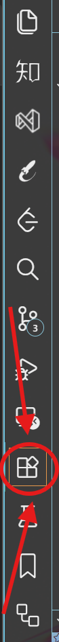

# 下载/安装

::: tabs
== Windows
[官网](https://rust-lang.org/tools/install/)下. 傻瓜式安装包.

== Linux & MacOS
```shell
curl https://sh.rustup.rs -sSf | sh
```

== Windows Subsystem for Linux
```shell
curl --proto '=https' --tlsv1.2 -sSf https://sh.rustup.rs | sh
```
:::
# 更新/卸载
## 更新 Rust
```shell
rustup update
```
## 卸载 Rust
```shell
rustup self uninstall
```

# 安装验证
```shell
rustc --version
```
没报错就是安好了, 否则检查环境变量或者试着重启一下, 还不行就重下.

# 开始学习
```shell
rustup doc
```
英文文档, 啥都有, 浏览器加载的本地文件.

# 开始开发
- Visual Studio Code
    - with **rust-analyzer** 插件.
    - 个人偏好 VSCode, 因为太好使了, 最大的优点是高度可定制, 包括修改工具本身的源码, 能够一站式编写你能想到的所有纯文本格式内容 (包括 $ \LaTeX $ 排版, `.txt` 码小说, etc.), 你想的话, 二进制文件也不是不能改.
- RustRover
    - by JetBrains
    - 相比手动搭脚手架, JB 推出的专精 Rust 工程开发的 RustRover 作为 IDE 肯定要更省心一些, 缺点是一门语言一个软件, 多学几门软件电脑里就别想放别的 IDE 了 (这何尝不是一种抢占生态位的商业竞争).
- Clion
    - Intellij Idea 系列.
    - with Rust 插件.
    - 妹听过, 教程说可以用.
- Vim
    - 如果你有凡人程序员所未曾拥有的内功, 并且你乐于手动做任何事.
- Notepad/记事本
    - 你乐于用手抓着吃饭, 你不需要工具, 所以你在用 Notepad 编写代码.
- Microsoft Word
    - 总有人希望直面惨淡的人生, 正视淋漓的鲜血. 向蛄蛹者致意.

# 哥 Visual Studio Code 在哪下啊?/ 哥插件在哪下啊?
## Visual Studio Code
点这个蓝字: [官网](https://code.visualstudio.com/). 然后眼不瞎就能找到. 傻瓜式安装包.
## rust-analyzer 插件
打开 VSCode, 侧边栏点击拓展图标:



**或者** 按下快捷键 `Ctrl + Shift + X`, 然后搜索 `rust-analyzer`, 点击正确条目右下角那个 `install` 或者 `安装`.