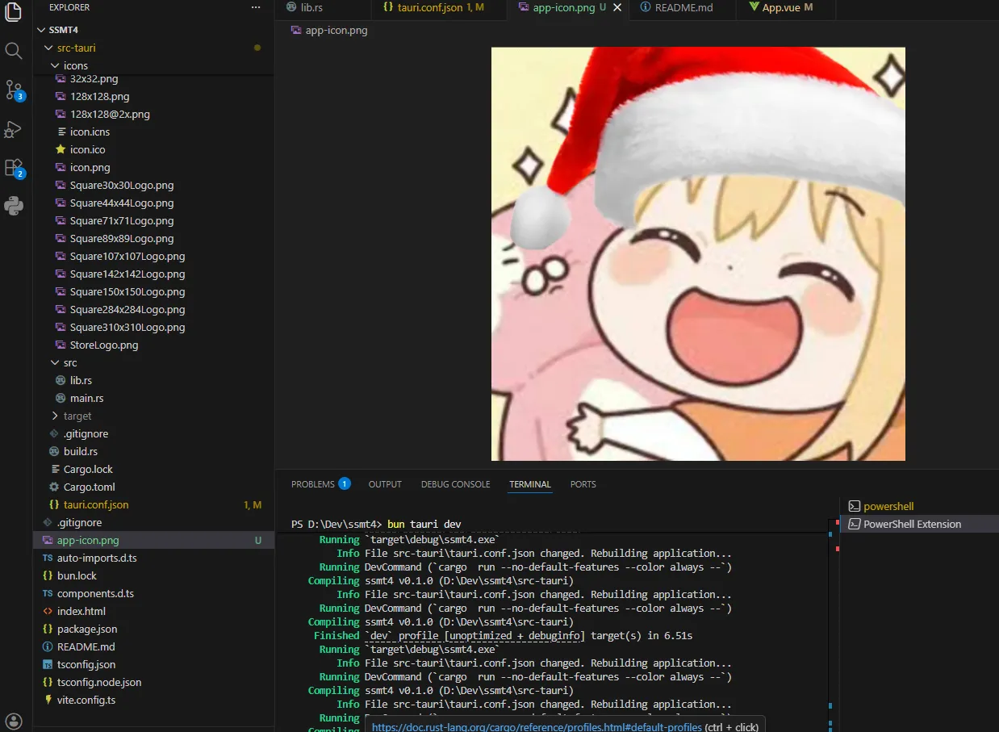
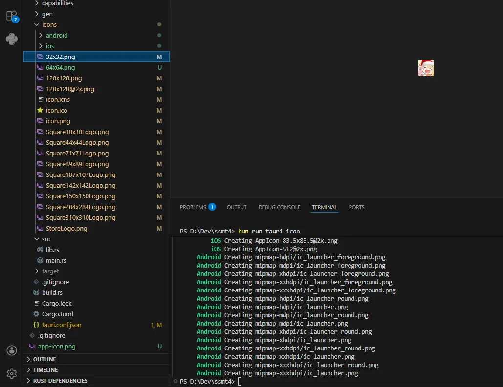
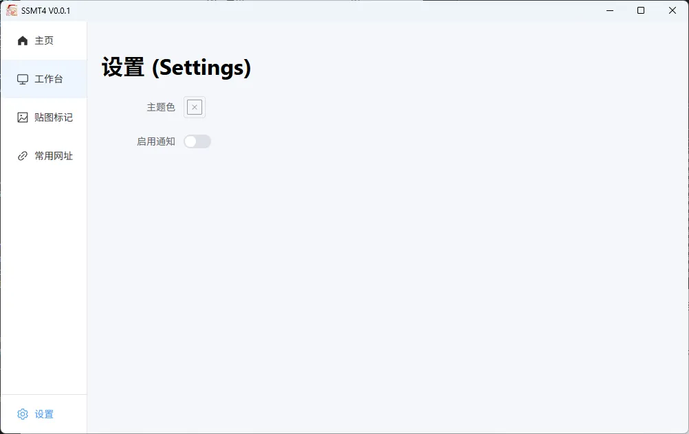

可别手动替换图标，tauri的图标是有操作规范的。

先把图片准备好，改名为app-icon.png，放到项目根目录下面

然后运行
`npm run tauri icon`

因为我们用的是bun

`bun run tauri icon`

一顿操作之后，图标就自动生成好了

但是由于缓存问题，所以我们如果bun tauri dev是无法看到新的图标的

只有在rust代码发生变动的时候才会触发重新编译打包。

解决方法很简单，tauri.conf.json中随便改点什么，例如版本号，然后重新bun tauri dev就行了

可以看到图标就正常修改完成了

