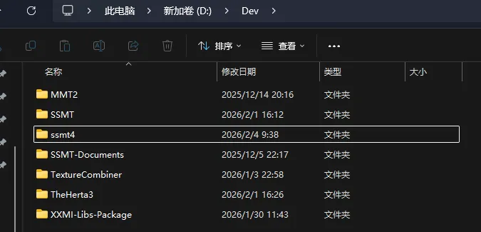
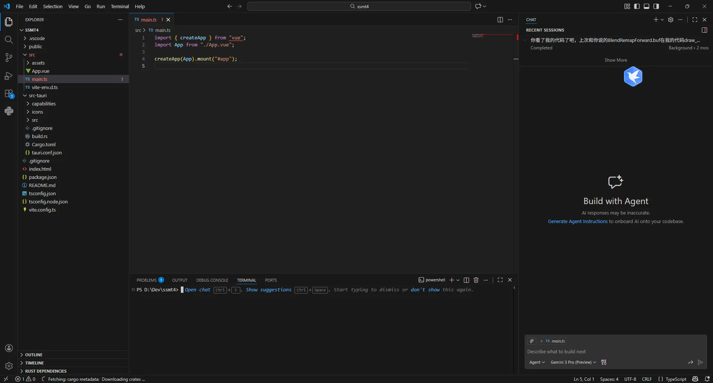
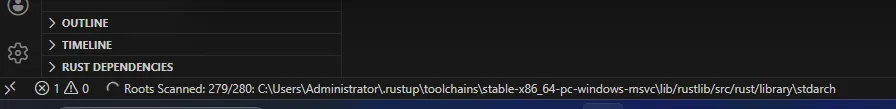
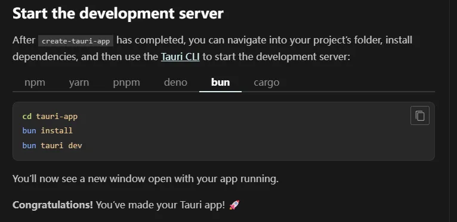

找个文件夹运行：
`bun create tauri-app`
随后一路填写参数
```
PS D:\Dev> bun create tauri-app
✔ Project name · ssmt4
✔ Identifier · ssmt4
✔ Choose which language to use for your frontend · TypeScript / JavaScript - (pnpm, yarn, npm, deno, bun)
✔ Choose your package manager · bun
✔ Choose your UI template · Vue - (https://vuejs.org/)
✔ Choose your UI flavor · TypeScript

Template created! To get started run:
  cd ssmt4
  bun install
  bun run tauri android init

For Desktop development, run:
  bun run tauri dev

For Android development, run:
  bun run tauri android dev

PS D:\Dev>

```

可以看到文件夹就被创建好了



然后使用VSCode打开，打开一个terminal准备初始化



先等待VSCode自己的初始化任务完成：



然后运行：



主要是bun install这个必须运行，不然的话项目的依赖就没法安装好，就没法运行项目

# 测试软件

`bun tauri dev`